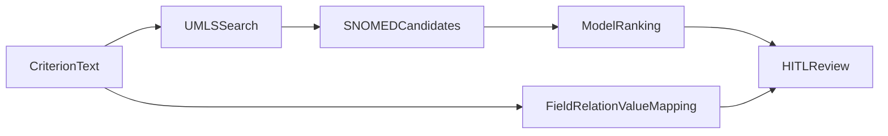

# Grounding Flow

```mermaid
flowchart LR
  criterion[CriterionText] --> umls[UMLSSearch]
  umls --> candidates[SNOMEDCandidates]
  candidates --> rank[ModelRanking]
  rank --> review[HITLReview]
  criterion --> fieldmap[FieldRelationValueMapping]
  fieldmap --> review
```
