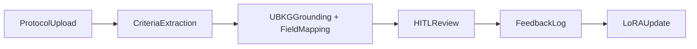

# HITL Flow

```mermaid
flowchart LR
  protocol[ProtocolUpload] --> extract[CriteriaExtraction]
  extract --> ground[UBKGGrounding + FieldMapping]
  ground --> review[HITLReview]
  review --> feedback[FeedbackLog]
  feedback --> retrain[LoRAUpdate]
```
