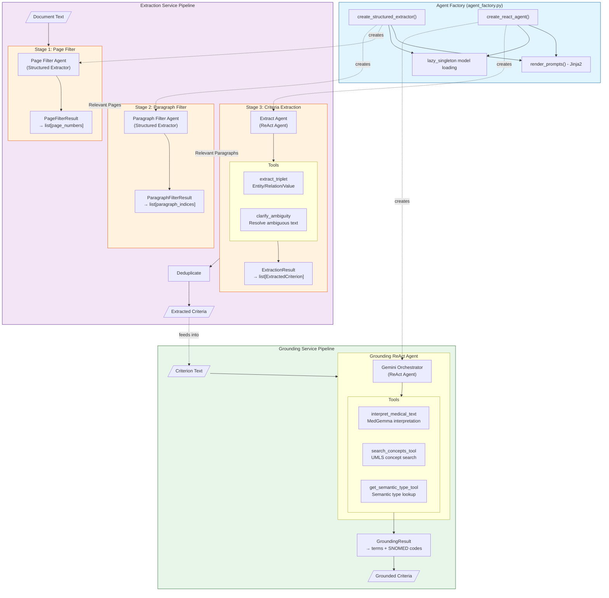

# LangGraph Architecture

This document describes the LangGraph-based agent architecture used throughout the system. The implementation uses LangGraph's prebuilt `create_react_agent` through a factory pattern, enabling reusable agent creation with structured output.

## Overview

The system uses two main LangGraph-based pipelines:

1. **Extraction Service Pipeline**: Hierarchical three-stage extraction (Page Filter → Paragraph Filter → Criteria Extraction)
2. **Grounding Service Pipeline**: Single ReAct agent with UMLS tools for SNOMED grounding

Both pipelines are built using the shared `agent_factory.py` which provides:
- Lazy model loading (shared across services)
- Jinja2 prompt rendering (service-specific templates)
- LangGraph ReAct agent execution for tool calling
- Structured output extraction using `model.with_structured_output()`

## Architecture Diagram

## Component Details

### Agent Factory (`components/inference/src/inference/agent_factory.py`)

The factory provides two main functions:

1. **`create_structured_extractor()`**: Creates a function that uses `model.with_structured_output()` for direct Pydantic model extraction. Used for simple classification/filtering tasks.

2. **`create_react_agent()`**: Creates a LangGraph ReAct agent that can execute tools iteratively, then extracts structured output from the final conversation. Used for complex tasks requiring tool calls.

Both functions:
- Use lazy singleton pattern for model loading (shared across invocations)
- Render prompts from Jinja2 templates
- Return validated Pydantic instances

### Extraction Service Pipeline

A hierarchical three-stage pipeline that progressively narrows down the document:

#### Stage 1: Page Filter
- **Type**: Structured Extractor (no tools)
- **Input**: Document split into pages
- **Output**: `PageFilterResult` with relevant page numbers
- **Purpose**: Quickly identify pages containing eligibility criteria

#### Stage 2: Paragraph Filter
- **Type**: Structured Extractor (no tools)
- **Input**: Relevant pages split into paragraphs
- **Output**: `ParagraphFilterResult` with relevant paragraph indices
- **Purpose**: Narrow down to specific paragraphs with criteria statements

#### Stage 3: Criteria Extraction
- **Type**: ReAct Agent with 2 tools
- **Tools**:
  - `extract_triplet`: Extracts entity/relation/value triplets from criterion text (uses MedGemma)
  - `clarify_ambiguity`: Resolves ambiguous text with targeted questions (cached per paragraph)
- **Input**: Relevant paragraphs
- **Output**: `ExtractionResult` with list of `ExtractedCriterion`
- **Recursion Limit**: 8 steps (2 tools, simpler task)
- **Purpose**: Extract atomic criteria with structured triplets

### Grounding Service Pipeline

A single ReAct agent that grounds extracted criteria to SNOMED codes:

#### Grounding Agent
- **Type**: ReAct Agent with 3 tools
- **Tools**:
  - `interpret_medical_text`: Uses MedGemma to interpret medical text and identify clinical concepts
  - `search_concepts_tool`: Searches UMLS for SNOMED candidates matching a term
  - `get_semantic_type_tool`: Retrieves semantic type information for UMLS concepts
- **Input**: Criterion text and type (inclusion/exclusion)
- **Output**: `GroundingResult` with grounded terms, SNOMED codes, and field mappings
- **Recursion Limit**: 10 steps (3 tools, more complex reasoning)
- **Purpose**: Map criteria text to SNOMED CT codes via UMLS API

## Design Patterns

### 1. Factory Pattern
The `agent_factory.py` centralizes agent creation, ensuring consistent configuration and lazy model loading across services.

### 2. Hierarchical Filtering
The extraction pipeline uses a document → pages → paragraphs → criteria hierarchy to:
- Reduce token costs (only process relevant content)
- Improve accuracy (focus on relevant sections)
- Enable parallel processing at each stage

### 3. Structured Output
All agents use `model.with_structured_output()` to return validated Pydantic instances, ensuring type safety and consistent schemas.

### 4. ReAct Pattern
Agents follow the ReAct (Reasoning + Acting) pattern:
1. Reason about the task
2. Decide which tool to call (if any)
3. Execute tool and observe results
4. Repeat until task is complete
5. Extract structured output from final conversation

### 5. Tool Composition
Tools are composed to enable complex workflows:
- **MedGemma** for medical interpretation and triplet extraction
- **UMLS API** for terminology grounding and semantic type lookup
- **Caching** for expensive operations (e.g., ambiguity clarification)

## Output Schemas

| Component | Output Schema | Key Fields |
|-----------|---------------|------------|
| Page Filter | `PageFilterResult` | `pages: list[int]` |
| Paragraph Filter | `ParagraphFilterResult` | `paragraph_indices: list[int]` |
| Extract Agent | `ExtractionResult` | `criteria: list[ExtractedCriterion]` |
| Grounding Agent | `GroundingResult` | `terms: list[GroundedTerm]`, `logical_operator: str` |

## Implementation Files

- **Factory**: `components/inference/src/inference/agent_factory.py`
- **Extraction Pipeline**: `components/extraction-service/src/extraction_service/pipeline.py`
- **Extraction Tools**: `components/extraction-service/src/extraction_service/tools.py`
- **Grounding Agent**: `components/grounding-service/src/grounding_service/agent.py`
- **Grounding Tools**: `components/grounding-service/src/grounding_service/tools.py`

## Related Documentation

- [Architecture Overview](../overview/architecture.md)
- [Extraction Service README](../../components/extraction-service/README.md)
- [Grounding Service README](../../components/grounding-service/README.md)
- [Inference Component README](../../components/inference/README.md)
