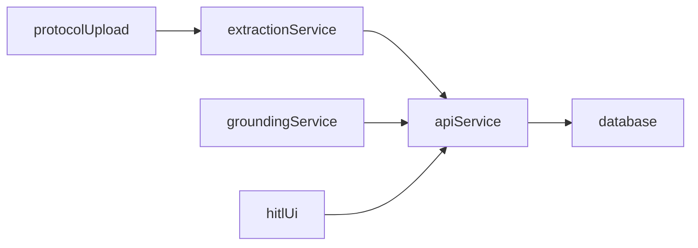

# Architecture

The system is structured as a component-based monorepo with distinct services for API, extraction, grounding, data ingestion, evaluation, and UI.

Key integration points:

- `POST /v1/protocols/{id}/extract` for extraction.
- `POST /v1/criteria/{id}/ground` for grounding.
- `POST /v1/hitl/feedback` for HITL edits.
