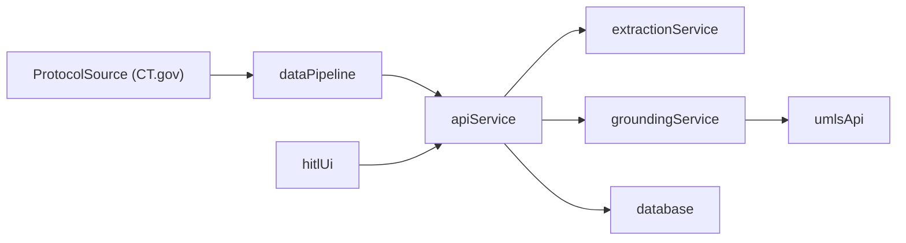

# Architecture

The system is structured as a component-based monorepo with distinct services for API, extraction, grounding, data ingestion, evaluation, and UI.

## Key Integration Points

- `POST /v1/protocols` to register protocol metadata and text/PDF.
- `POST /v1/protocols/{id}/extract` to trigger extraction.
- `POST /v1/criteria/{id}/ground` to retrieve SNOMED candidates and field/relation/value mapping suggestions.
- `POST /v1/hitl/feedback` to log nurse actions.

## Component Responsibilities

| Component | Responsibilities |
| --- | --- |
| `api-service` | Orchestration, persistence, request validation, HITL feedback. |
| `extraction-service` | Extract atomic criteria and classify inclusion/exclusion. |
| `grounding-service` | UMLS REST lookup for SNOMED candidates + field/relation/value mapping suggestions. |
| `data-pipeline` | Protocol ingestion and normalization. |
| `evaluation` | Metrics (extraction F1, SNOMED Top-1, field mapping quality, HITL stats). |
| `shared` | Shared schemas and types. |
| `hitl-ui` | Nurse-facing review, edit, and evidence display. |

## Storage

- `protocols`: protocol metadata and trial IDs.
- `documents`: protocol text and provenance.
- `criteria`: atomic criteria with type and evidence spans.
- `groundings`: SNOMED candidates, confidence scores, and field/relation/value mappings.
- `hitl_edits`: nurse actions for audit and retraining.

## LangGraph Agent Architecture

The system uses LangGraph's ReAct agents for extraction and grounding tasks. See the [LangGraph Architecture diagram](../diagrams/langgraph-architecture.md) for detailed information about:

- Agent factory pattern for reusable agent creation
- Hierarchical extraction pipeline (Page Filter → Paragraph Filter → Criteria Extraction)
- Grounding service with UMLS tools
- Tool composition and structured output patterns
